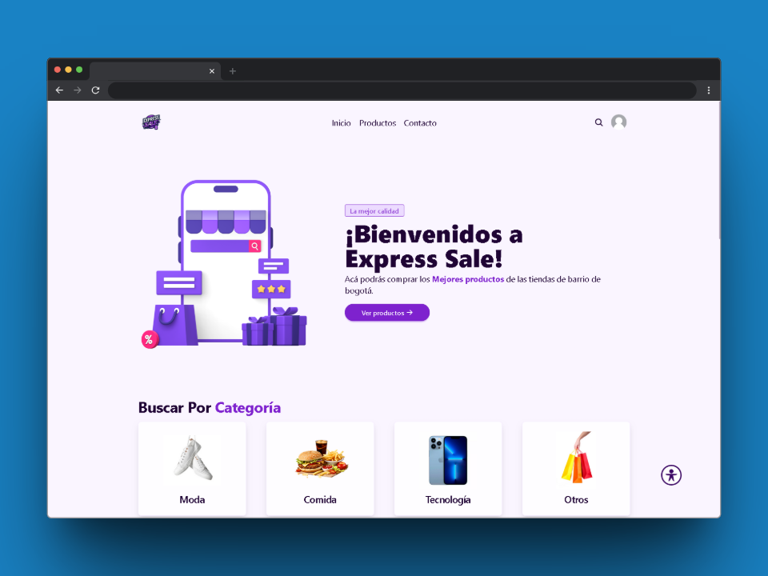
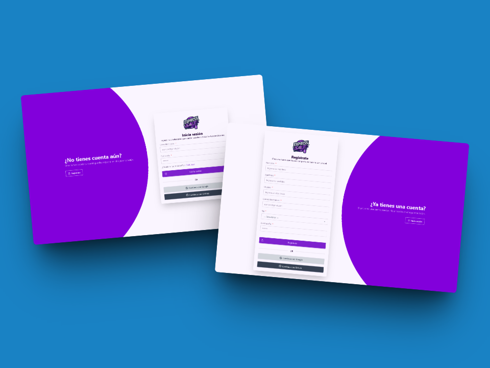
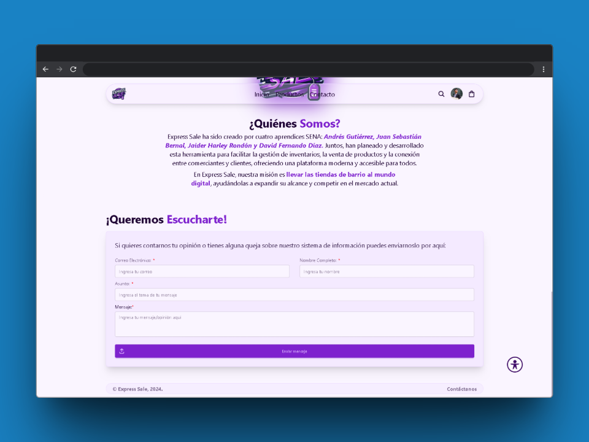
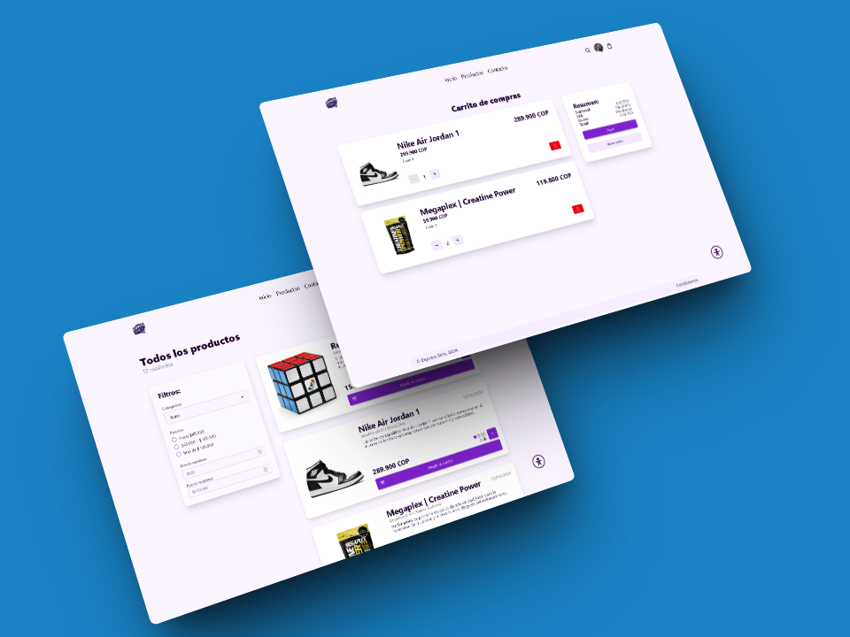
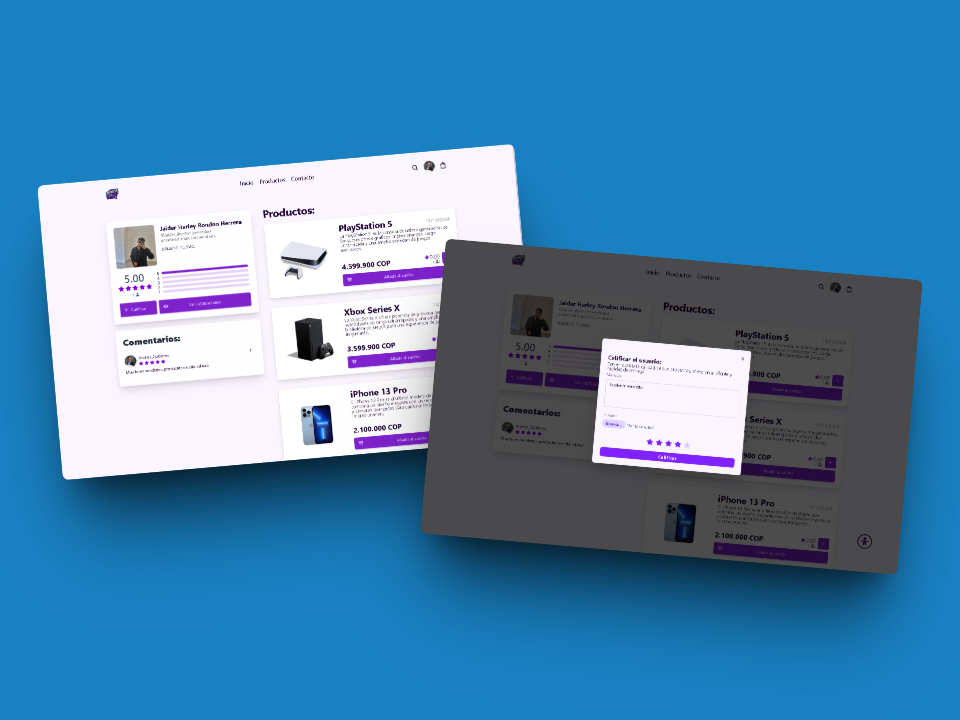
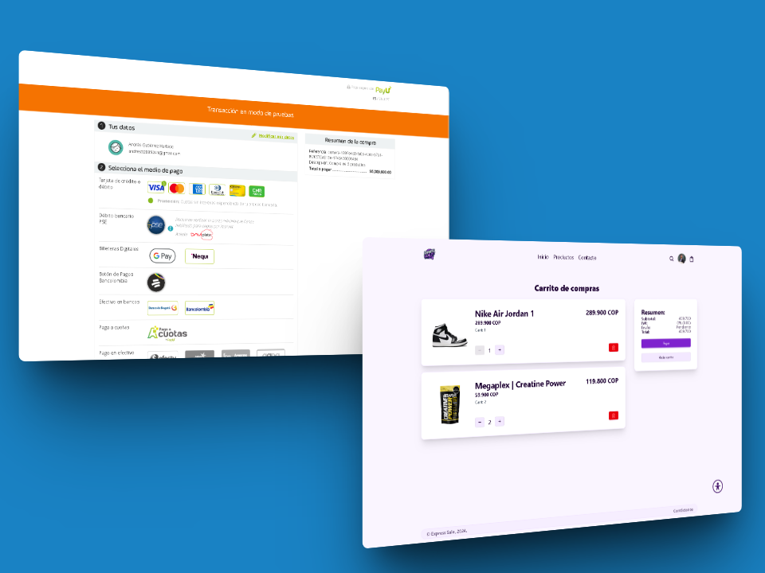
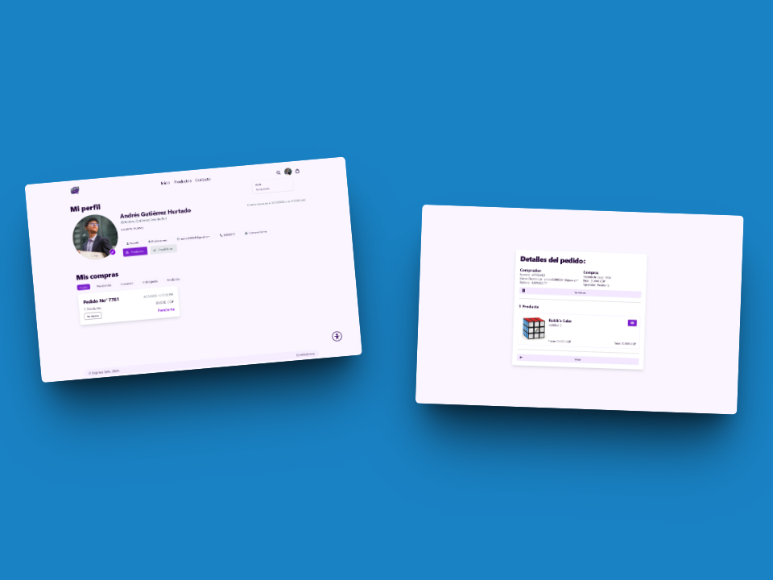
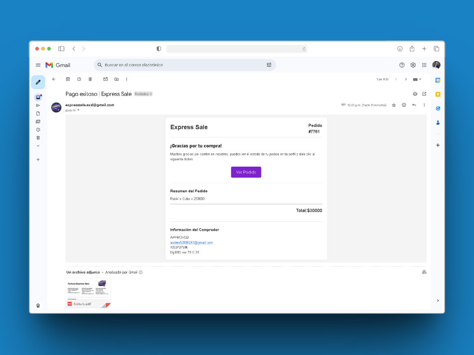
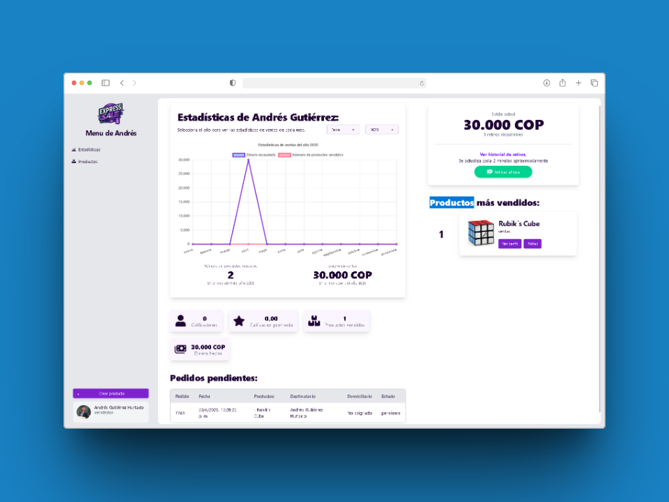
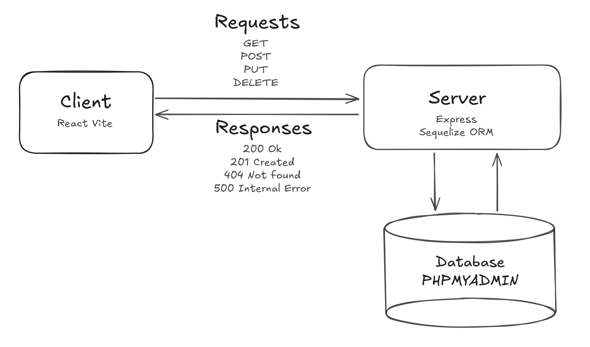

# 🛒 Express Sale

[English Version](README.md)

[Versión para teléfonos](https://github.com/AndresGutierrezHurtado/express-sale-mobile)

**Express Sale** es una aplicación de e-commerce desarrollada en **React**, diseñada para fortalecer el comercio local en las localidades de **Ciudad Bolívar** y **Usme**, en Bogotá. Su plataforma intuitiva y moderna permite a los usuarios explorar catálogos de productos, realizar compras, calificar vendedores y hacer seguimiento de pedidos de manera rápida, segura y localizada. Esta solución tecnológica fomenta el crecimiento de los negocios de barrio en zonas con menor acceso a herramientas digitales, facilitando la conexión entre tiendas y compradores mediante funciones optimizadas por geolocalización.



---

## 📚 Tabla de Contenidos

-   [Características Principales](#-características-principales)
-   [Tecnologías Utilizadas](#️-tecnologías-utilizadas)
-   [Arquitectura](#-arquitectura)
-   [Flujo de Uso](#-flujo-de-uso)
-   [Estructura de Carpetas](#-estructura-de-carpetas)
-   [Instalación](#-instalación)
-   [Contribuciones](#-contribuciones)
-   [Contacto](#-contacto)

---

## 🚀 Características Principales

✅ **Autenticación de usuarios con diferentes métodos de acceso**  
Permite a los usuarios registrarse e iniciar sesión mediante correo electrónico, así como autenticarse usando plataformas externas como Google o GitHub. Esto mejora la accesibilidad y simplifica el proceso de ingreso a la plataforma.



📝 **Sistema de retroalimentación para enviar sugerencias o comentarios**  
Incluye un formulario accesible desde el perfil del usuario, donde se pueden enviar opiniones, reportar errores o sugerir mejoras. Esta información es gestionada por los administradores para optimizar la experiencia del usuario.



🛍️ **Catálogo de productos, búsqueda, calificación y carrito de compras**  
Los usuarios pueden explorar un amplio catálogo de productos clasificados por categorías, realizar búsquedas por nombre o descripción, calificar productos después de la compra, y agregar artículos a un carrito persistente incluso después de cerrar sesión.



👥 **Perfiles de vendedores con sistema de calificación**  
Cada tienda cuenta con un perfil donde los usuarios pueden consultar información básica, ver productos ofrecidos, leer reseñas y calificar el servicio recibido, fomentando la transparencia y confianza entre compradores y vendedores.



💳 **Pagos seguros con múltiples opciones**  
La plataforma soporta pagos a través de tarjetas de crédito/débito, PayPal, y otros métodos disponibles en Colombia como PSE. Todos los pagos están protegidos mediante cifrado SSL y tokenización para asegurar la información financiera de los usuarios.



📦 **Historial de pedidos y facturación**  
Los usuarios pueden visualizar sus compras anteriores, revisar el estado actual de sus pedidos (pendiente, en camino, entregado), y descargar facturas generadas automáticamente por el sistema para cada transacción.




📍 **Distribución optimizada por ubicación**  
Gracias a la integración con APIs de geolocalización, el sistema asigna los pedidos a las tiendas más cercanas al usuario. Esto reduce tiempos de entrega y permite una logística más eficiente para las tiendas registradas en Ciudad Bolívar y Usme.


👤 **Perfil de trabajador con estadísticas personalizadas**  
Los trabajadores o administradores de tienda cuentan con un dashboard donde pueden consultar estadísticas de ventas, pedidos entregados, comentarios recibidos, productos más vendidos, y otros indicadores clave para la toma de decisiones.



---

## 🛠️ Tecnologías Utilizadas

### **Frontend**

-   React 18
-   TailwindCSS V4
-   DaisyUI V5
-   React Chartjs 2
-   Swiper
-   valibot
-   sweet alert
-   tilt js

### **Backend**

-   Node.js
-   Express.js
-   Express Auth
-   Sequelize ORM
-   MySQL
-   PayU

---

## 🧱 Arquitectura

El proyecto sigue una arquitectura basada en componentes y servicios desacoplados, usando el patrón **MVC (Modelo-Vista-Controlador)** para el backend, y una estructura modular para React en el frontend.



---

## 🔄 Flujo de Uso

La plataforma **Express Sale** está diseñada para adaptarse a tres tipos principales de usuario: **Comprador, Vendedor y Administrador**. A continuación, se describe el flujo de uso para cada uno:

---

### 🛍️ Comprador

El comprador es el usuario final que navega por la tienda, realiza compras y hace seguimiento de sus pedidos.

1. **Registro e inicio de sesión**  
   El comprador accede mediante email o plataformas externas (Google, GitHub).

2. **Explorar productos**  
   Busca productos por nombre o categoría, y visualiza detalles como precio, descripción, calificaciones y tienda vendedora.

3. **Agregar productos al carrito**  
   Añade uno o varios productos al carrito, el cual permanece persistente entre sesiones.

4. **Proceso de compra**  
   Confirma su dirección (geolocalización) y elige un método de pago seguro (tarjeta, PayPal, PSE).

5. **Seguimiento del pedido**  
   Puede consultar el estado del pedido en tiempo real (pendiente, enviado, entregado) y descargar la factura.

6. **Historial y calificación**  
   Visualiza todas sus compras anteriores, califica productos y deja comentarios para los vendedores.

---

### 🧑‍🍳 Vendedor

El vendedor representa una tienda local que publica sus productos en la plataforma.

1. **Registro e inicio de sesión**  
   Inicia sesión con su cuenta autorizada como vendedor.

2. **Gestión de productos**  
   Puede **crear, editar o eliminar productos**, incluyendo nombre, precio, descripción, imágenes y stock disponible.

3. **Consulta de pedidos asignados**  
   Revisa los pedidos asociados a sus productos según la ubicación del comprador.

4. **Panel de control**  
   Accede a estadísticas de ventas, productos más comprados y comentarios de los usuarios.

---

### 🛠️ Administrador

El administrador tiene privilegios especiales para gestionar la plataforma y garantizar su correcto funcionamiento.

1. **Inicio de sesión como administrador**  
   Accede al panel administrativo mediante credenciales especiales.

2. **Gestión de usuarios**  
   Puede consultar, editar, bloquear o eliminar cuentas de usuarios y vendedores.

3. **Gestión de productos globales**  
   Supervisa todos los productos en la plataforma, con capacidad para editarlos o eliminarlos si incumplen normas.

4. **Monitoreo de actividad**  
   Visualiza estadísticas generales, pedidos activos, reportes de retroalimentación y rendimiento general del sistema.

---

## 📁 Estructura de Carpetas

```txt
express-sale/
├── client/                         # Aplicación frontend construida con React
│   ├── public/                     # Archivos estáticos públicos (index.html, íconos, etc.)
│   └── src/                        # Código fuente principal de React
│       ├── app.jsx                 # Componente raíz de la aplicación
│       ├── main.jsx                # Punto de entrada donde se monta la app
│       ├── components/             # Componentes reutilizables (inputs, cards, modals, etc.)
│       ├── layouts/                # Diseños base reutilizables (navbar, sidebar, etc.)
│       ├── pages/                  # Vistas completas (Home, Login, Productos, etc.)
│       ├── hooks/                  # Hooks personalizados para lógica compartida (useAuth, etc.)
│       ├── contexts/               # Contextos de estado global (AuthContext, CartContext)
│       └── middlewares/            # Validaciones del lado del cliente antes de ejecutar acciones

├── server/                         # Aplicación backend con Express.js
│   ├── public/                     # Archivos servidos directamente por el backend (imágenes, etc.)
│   └── src/                        # Código fuente principal del servidor
│       ├── config/                 # Configuración del servidor (conexión DB, variables entorno)
│       ├── controllers/            # Lógica de negocio para cada recurso (usuarios, productos, etc.)
│       ├── hooks/                  # Lógica compartida en el backend (validaciones, helpers, etc.)
│       ├── models/                 # Definiciones de modelos de base de datos
│       ├── routes/                 # Definición de rutas y endpoints de la API REST
│       ├── templates/              # Plantillas de correo o documentos generados
│       ├── express-sale-db.sql     # Script SQL para crear la base de datos y sus tablas
│       └── index.js                # Archivo principal que arranca el servidor Express
```

---

## 💾 Instalación

### Requisitos Previos

-   Node.js >= 18.x
-   Xampp
-   Git

### Instrucciones

### Pasos para instalar y ejecutar Express Sale

1. Clonar el repositorio:
2. Descargar dependencias
3. Crear .env en client y sever
4. Ejecutar el cliente y el servidor

---

## 🤝 Contribuciones

¿Te gustaría colaborar? ¡Eres bienvenido!

1. Haz un fork del repositorio.
2. Crea una rama con tu nueva funcionalidad: `git checkout -b nueva-funcionalidad`
3. Haz commit de tus cambios: `git commit -m 'Agrega nueva funcionalidad'`
4. Sube tu rama: `git push origin nueva-funcionalidad`
5. Abre un Pull Request explicando tus mejoras.

---

## 📬 Contacto

Para preguntas, soporte o colaboración, por favor contacta:

-   Andrés Gutiérrez Hurtado
-   Correo: [andres52885241@gmail.com](mailto:andres52885241@gmail.com)
-   LinkedIn: [Andrés Gutiérrez](https://www.linkedin.com/in/andr%C3%A9s-guti%C3%A9rrez-hurtado-25946728b/)
-   GitHub: [@AndresGutierrezHurtado](https://github.com/AndresGutierrezHurtado)
-   Portafolio: [Link portafolio](https://andres-portfolio-b4dv.onrender.com)
